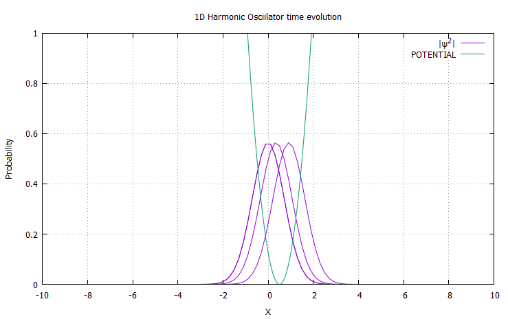
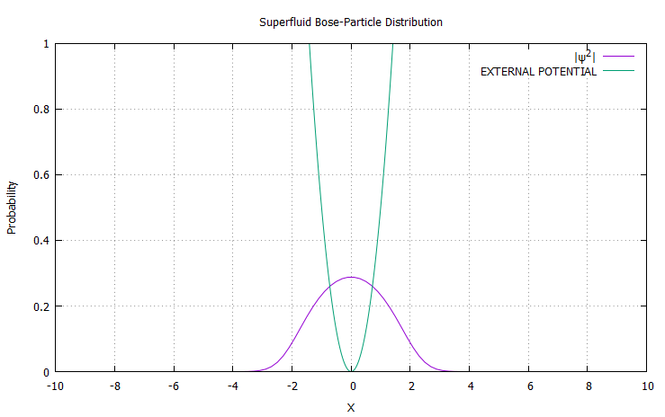

# Quon
Quantum Mechanics Library with Fast Calculation/Easy Implementation for C++

## 1D Harmonic Oscillator
### Example 1: Simulation of 1D Harmonic Oscillator's time development


```c++
#include "lib/Basis/Basis1D.h"
#include "lib/Operator/Hamiltonian1D.h"
#include "lib/Stream/QuFile.h"

// Define the form of potential
double V(double x, const complex<double>* Phi, int i) {
    return 0.5*(x - 0.5)*(x - 0.5);
}

int main() {
    // Create a system
    quon::Basis1D basis(100, 0.2);
    // Apply boundary condition
    basis <<= quon::BOUNDARY_CONDITION(quon::BC_MODE::PERIODIC);
    // Add an initial wave function
    basis <<= quon::WF_FORM::GAUSSIAN;
    // Create Hamiltonian instance
    quon::Hamiltonian1D H(1.0, 1.0, PotentialFunction);
    // Create file stream wrapper instance
    quon::QuFile file("data.txt");
    
    // Save initial state into a text file
    file <<= basis;
    for (int i = 0; i < 5000; i++) {
        // Real time evolution
        basis = basis.evolve(0.01, H, false);
        // Save the state at every iteration
        file <<= basis;
    }
}
```
    

<br>

## Superfluid
### Example 2: Ground state of 1D Gross-Pitaevskii Equation


```c++
#include "lib/Basis/Basis1D.h"
#include "lib/Operator/Hamiltonian1D.h"
#include "lib/Stream/QuFile.h"

double V(double x, const complex<double>* Phi, int i) {
    // The second term implies the "Boson interaction term"
    return 0.5*x*x + 10*norm(Phi[i]);
}

int main() {
    quon::Basis1D basis(100, 0.2);
    basis <<= quon::BOUNDARY_CONDITION(quon::BC_MODE::PERIODIC);
    basis <<= quon::WF_FORM::GAUSSIAN;
    quon::Hamiltonian1D H(1.0, 1.0, PotentialFunction);
    
    quon::QuFile file("data.txt");
    file <<= basis;
    for (int i = 0; i < 5000; i++) {
        // Imaginary time evolution
        basis = basis.evolve(0.01, H, true);
    }
    file <<= basis;
}
```
    
